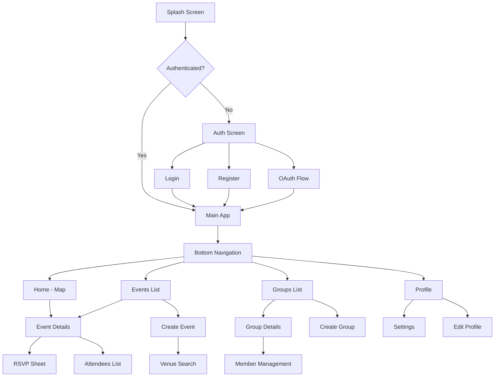

# MatchTCG Flutter App - Design Document

## Overview

The MatchTCG Flutter app is designed as a cross-platform application (iOS, Android, Web) that connects Trading Card Game players through event discovery and community management. The design emphasizes a dark-first approach with a neon aesthetic, intuitive navigation, and accessibility compliance.

### Design Principles
- **Dark-First Design**: Primary focus on dark mode with neon accents for gaming aesthetic
- **Accessibility**: WCAG AA compliance with proper contrast ratios and touch targets
- **Performance**: Optimized for smooth 60fps animations and quick load times
- **Internationalization**: Seamless pt-PT/en language switching with proper RTL readiness
- **Mobile-First**: Responsive design that scales from mobile to web

## Architecture

### High-Level Architecture
```
┌─────────────────┐    ┌─────────────────┐    ┌─────────────────┐
│   Presentation  │    │   Application   │    │   Infrastructure│
│     Layer       │    │     Layer       │    │     Layer       │
├─────────────────┤    ├─────────────────┤    ├─────────────────┤
│ • Screens       │    │ • Riverpod      │    │ • HTTP Client   │
│ • Widgets       │◄──►│   Providers     │◄──►│ • Secure Storage│
│ • Themes        │    │ • State Mgmt    │    │ • Map Services  │
│ • Localization  │    │ • Business Logic│    │ • Auth Services │
└─────────────────┘    └─────────────────┘    └─────────────────┘
```

### Technology Stack
- **Framework**: Flutter 3.x
- **State Management**: Riverpod for simplicity and testability
- **Routing**: go_router with deep linking support
- **HTTP**: Dio with Retrofit for type-safe API calls
- **Maps**: MapLibre GL (default) with Google Maps fallback
- **Storage**: flutter_secure_storage with web localStorage fallback
- **Localization**: flutter_localizations + intl with .arb files
- **Authentication**: JWT with OAuth2 (Google/Apple) via backend

### Project Structure
```
lib/
├── core/
│   ├── constants/
│   ├── theme/
│   ├── utils/
│   └── extensions/
├── data/
│   ├── models/
│   ├── repositories/
│   └── services/
├── domain/
│   ├── entities/
│   └── repositories/
├── presentation/
│   ├── screens/
│   ├── widgets/
│   └── providers/
├── l10n/
└── main.dart
```

## Design System

### Color Palette (Dark Neon Theme)

| Color Role | Hex Code | Usage |
|------------|----------|-------|
| Background | #0F172A | Main app background (Preto carvão) |
| Surface | #111827 | Card backgrounds, elevated surfaces |
| Surface Variant | #0B1220 | Gradient end for cards |
| Primary | #22C55E | CTAs, FAB, active states (Verde neon) |
| Secondary | #9333EA | Icons, accents, highlights (Roxo neon) |
| On Surface | #E5E7EB | Primary text (Cinza claro) |
| On Surface Variant | #9CA3AF | Secondary text, labels |
| Outline | #1F2937 | Borders, dividers |
| Success | #22C55E | Success states, confirmations |
| Warning | #F59E0B | Warning states, cautions |
| Error | #EF4444 | Error states, destructive actions |

### Typography Scale

| Style | Font | Weight | Size | Line Height | Usage |
|-------|------|--------|------|-------------|-------|
| Display Large | Inter | 700 | 32sp | 40sp | Page titles |
| Display Medium | Inter | 600 | 28sp | 36sp | Section headers |
| Headline Large | Inter | 600 | 24sp | 32sp | Card titles |
| Headline Medium | Inter | 600 | 20sp | 28sp | List item titles |
| Body Large | Inter | 500 | 16sp | 24sp | Primary body text |
| Body Medium | Inter | 400 | 14sp | 20sp | Secondary text |
| Label Large | Inter | 500 | 14sp | 20sp | Button labels |
| Label Medium | Inter | 500 | 12sp | 16sp | Form labels |

### Spacing System
- **Base Unit**: 4dp
- **Micro**: 4dp (1x)
- **Small**: 8dp (2x)
- **Medium**: 16dp (4x)
- **Large**: 24dp (6x)
- **XLarge**: 32dp (8x)
- **XXLarge**: 48dp (12x)

### Elevation and Shadows
- **Level 0**: No elevation (background)
- **Level 1**: 2dp elevation (cards, buttons)
- **Level 2**: 4dp elevation (FAB, app bar)
- **Level 3**: 8dp elevation (modal sheets)
- **Level 4**: 16dp elevation (dialogs)

### Border Radius
- **Small**: 8dp (chips, small buttons)
- **Medium**: 12dp (cards, input fields)
- **Large**: 16dp (bottom sheets, large cards)
- **XLarge**: 20dp (brand elements)
- **Circular**: 50% (avatars, FAB)

## Components and Interfaces

### Core Components

#### 1. App Bar Component
```dart
MatchTCGAppBar({
  String? title,
  List<Widget>? actions,
  bool showBackButton = true,
  Color? backgroundColor,
})
```
- **Design**: Dark background (#111827) with neon brand logo
- **Height**: 56dp on mobile, 64dp on web
- **Typography**: Headline Medium for title
- **Actions**: Max 3 action buttons with 48dp touch targets

#### 2. Bottom Navigation Bar
```dart
MatchTCGBottomNav({
  int currentIndex,
  Function(int) onTap,
})
```
- **Tabs**: Home (Map), Events, Groups, Profile
- **Design**: Dark surface with neon accent for active tab
- **Height**: 80dp with 56dp touch targets
- **Icons**: Line style with duotone active states

#### 3. Event Card Component
```dart
EventCard({
  EventResponse event,
  VoidCallback? onTap,
  bool showRSVP = true,
})
```
- **Layout**: Image header, title, metadata, RSVP button
- **Dimensions**: Full width, 120dp height
- **Surface**: Gradient from #111827 to #0B1220
- **Border Radius**: 12dp with neon accent border for featured events

#### 4. Map Pin Component
```dart
MapPin({
  EventResponse event,
  bool isSelected = false,
  VoidCallback? onTap,
})
```
- **Design**: Card + Pin motif in neon outline
- **Size**: 32dp default, 40dp when selected
- **Colors**: Primary (#22C55E) for public, Secondary (#9333EA) for group events
- **Animation**: Scale and glow effect on selection

#### 5. Filter Chips
```dart
FilterChip({
  String label,
  bool isSelected,
  VoidCallback onTap,
})
```
- **Design**: Rounded rectangle with outline
- **States**: Unselected (outline), Selected (filled with primary)
- **Height**: 32dp with 8dp horizontal padding
- **Typography**: Label Medium

#### 6. Form Components

##### Text Input Field
```dart
MatchTCGTextField({
  String? label,
  String? hint,
  TextInputType? keyboardType,
  bool obscureText = false,
  String? Function(String?)? validator,
})
```
- **Design**: Dark surface with neon accent border on focus
- **Height**: 56dp
- **Border Radius**: 12dp
- **Typography**: Body Large for input, Label Medium for label

##### Primary Button
```dart
PrimaryButton({
  String text,
  VoidCallback? onPressed,
  bool isLoading = false,
})
```
- **Design**: Filled with primary color (#22C55E)
- **Height**: 48dp
- **Border Radius**: 12dp
- **Typography**: Label Large, white text
- **States**: Normal, Pressed, Disabled, Loading

##### Secondary Button
```dart
SecondaryButton({
  String text,
  VoidCallback? onPressed,
})
```
- **Design**: Outlined with primary color
- **Height**: 48dp
- **Typography**: Label Large, primary color text

#### 7. Bottom Sheet Component
```dart
MatchTCGBottomSheet({
  Widget child,
  bool isDismissible = true,
})
```
- **Design**: Dark surface with rounded top corners (20dp)
- **Handle**: 32dp wide, 4dp height indicator
- **Max Height**: 90% of screen height
- **Animation**: Slide up with backdrop blur

### Navigation Structure



### Routing Configuration
```dart
final router = GoRouter(
  initialLocation: '/',
  routes: [
    GoRoute(path: '/', builder: (context, state) => SplashScreen()),
    GoRoute(path: '/auth', builder: (context, state) => AuthScreen()),
    ShellRoute(
      builder: (context, state, child) => MainShell(child: child),
      routes: [
        GoRoute(path: '/home', builder: (context, state) => HomeScreen()),
        GoRoute(path: '/events', builder: (context, state) => EventsScreen()),
        GoRoute(path: '/groups', builder: (context, state) => GroupsScreen()),
        GoRoute(path: '/profile', builder: (context, state) => ProfileScreen()),
      ],
    ),
    GoRoute(path: '/event/:id', builder: (context, state) => EventDetailsScreen()),
    GoRoute(path: '/group/:id', builder: (context, state) => GroupDetailsScreen()),
  ],
);
```

## Screen Blueprints

### 1. Home Screen (Map View)

#### Layout Structure
```
┌─────────────────────────────────────┐
│ App Bar: "MatchTCG" + Profile Avatar│
├─────────────────────────────────────┤
│                                     │
│           Map Container             │
│        (Event Pins Overlay)         │
│                                     │
│                                     │
├─────────────────────────────────────┤
│ [Radius Filter] [Game Filter]       │
├─────────────────────────────────────┤
│ Bottom Navigation                   │
└─────────────────────────────────────┘
```

#### States
- **Loading**: Map skeleton with shimmer effect
- **Empty**: Map with "No events nearby" message and "Expand search" button
- **Error**: Map with error message and retry button
- **Success**: Map with event pins and filter chips

#### Interactions
- **Pin Tap**: Show event bottom sheet with quick RSVP
- **Filter Change**: Update map pins with animation
- **Location Button**: Center map on user location
- **Search Bar**: Text search with autocomplete

### 2. Events List Screen

#### Layout Structure
```
┌─────────────────────────────────────┐
│ App Bar: "Events" + Search Icon     │
├─────────────────────────────────────┤
│ [All] [MTG] [Lorcana] [Pokemon]     │
├─────────────────────────────────────┤
│ ┌─────────────────────────────────┐ │
│ │ Event Card 1                    │ │
│ └─────────────────────────────────┘ │
│ ┌─────────────────────────────────┐ │
│ │ Event Card 2                    │ │
│ └─────────────────────────────────┘ │
│ ...                                 │
├─────────────────────────────────────┤
│ Bottom Navigation                   │
└─────────────────────────────────────┘
```

#### States
- **Loading**: List of card skeletons
- **Empty**: "No events found" with create event CTA
- **Error**: Error message with retry button
- **Success**: Scrollable list with pull-to-refresh

#### Interactions
- **Card Tap**: Navigate to event details
- **Filter Tap**: Update list with loading state
- **FAB Tap**: Navigate to create event
- **Pull to Refresh**: Reload events list

### 3. Event Details Screen

#### Layout Structure
```
┌─────────────────────────────────────┐
│ App Bar: Back + Share + More        │
├─────────────────────────────────────┤
│ Event Image/Game Icon               │
├─────────────────────────────────────┤
│ Event Title                         │
│ Date & Time • Location              │
│ Host Name • Attendee Count          │
├─────────────────────────────────────┤
│ [Going] [Interested] [Declined]     │
├─────────────────────────────────────┤
│ Description                         │
│ Rules & Format                      │
│ Entry Fee (if any)                  │
├─────────────────────────────────────┤
│ [Add to Calendar] [View Attendees]  │
├─────────────────────────────────────┤
│ Venue Information                   │
│ Map Preview                         │
└─────────────────────────────────────┘
```

#### States
- **Loading**: Content skeleton with shimmer
- **Error**: Error message with retry button
- **Success**: Full event information with interactive elements
- **RSVP Loading**: Button shows loading spinner

### 4. Create Event Screen

#### Layout Structure
```
┌─────────────────────────────────────┐
│ App Bar: "Create Event" + Save      │
├─────────────────────────────────────┤
│ Event Title Input                   │
├─────────────────────────────────────┤
│ Game Selection Chips                │
├─────────────────────────────────────┤
│ Date & Time Pickers                 │
├─────────────────────────────────────┤
│ Venue Selection                     │
│ [Search Venues] [Create New]        │
├─────────────────────────────────────┤
│ Description Input (Optional)        │
├─────────────────────────────────────┤
│ Visibility Settings                 │
│ ○ Public ○ Private ○ Group Only     │
├─────────────────────────────────────┤
│ Capacity Input (Optional)           │
├─────────────────────────────────────┤
│ Entry Fee Input (Optional)          │
└─────────────────────────────────────┘
```

#### Validation States
- **Field Errors**: Red border and error text below invalid fields
- **Form Valid**: Save button enabled with primary color
- **Form Invalid**: Save button disabled with muted color
- **Saving**: Loading overlay with progress indicator

## Data Models

### Core Domain Models

#### Event Model
```dart
class Event {
  final String id;
  final String title;
  final String? description;
  final GameType game;
  final String? format;
  final EventVisibility visibility;
  final DateTime startAt;
  final DateTime endAt;
  final String timezone;
  final int attendeeCount;
  final int? capacity;
  final double? entryFee;
  final User host;
  final Venue? venue;
  final Group? group;
  final RSVPStatus? userRSVPStatus;
  final List<String> tags;
}
```

#### User Model
```dart
class User {
  final String id;
  final String email;
  final String? displayName;
  final Locale locale;
  final String timezone;
  final String? city;
  final String? country;
  final List<GameType> preferredGames;
  final Map<String, dynamic> visibilitySettings;
}
```

#### Group Model
```dart
class Group {
  final String id;
  final String name;
  final String? description;
  final User? owner;
  final int memberCount;
  final GroupRole? userRole;
  final List<GroupMember>? members;
  final DateTime createdAt;
}
```

### State Management Architecture

#### Riverpod Providers Structure
```dart
// Authentication State
final authStateProvider = StateNotifierProvider<AuthNotifier, AuthState>((ref) {
  return AuthNotifier(ref.read(authRepositoryProvider));
});

// User Profile State
final userProfileProvider = FutureProvider<User>((ref) async {
  final authState = ref.watch(authStateProvider);
  if (authState.isAuthenticated) {
    return ref.read(userRepositoryProvider).getCurrentUser();
  }
  throw Exception('Not authenticated');
});

// Events State
final eventsProvider = StateNotifierProvider<EventsNotifier, EventsState>((ref) {
  return EventsNotifier(ref.read(eventRepositoryProvider));
});

// Map Events State (filtered)
final mapEventsProvider = Provider<List<Event>>((ref) {
  final events = ref.watch(eventsProvider).events;
  final filters = ref.watch(eventFiltersProvider);
  return events.where((event) => filters.matches(event)).toList();
});

// Localization State
final localeProvider = StateNotifierProvider<LocaleNotifier, Locale>((ref) {
  return LocaleNotifier();
});
```

## Error Handling

### Error Types and UI Responses

| Error Type | UI Response | User Action |
|------------|-------------|-------------|
| Network Error | Snackbar with retry button | Tap retry or wait for auto-retry |
| Authentication Error | Redirect to login screen | Re-authenticate |
| Validation Error | Field-specific error messages | Correct input and resubmit |
| Rate Limiting | Toast with countdown timer | Wait for cooldown period |
| Server Error | Generic error dialog | Contact support or try later |
| Not Found | Empty state with helpful message | Navigate back or search again |

### Error Recovery Strategies
- **Automatic Retry**: Network requests with exponential backoff
- **Offline Mode**: Cache last successful responses for 24 hours
- **Graceful Degradation**: Show partial data when some requests fail
- **User Feedback**: Clear error messages with actionable next steps

## Testing Strategy

### Unit Testing
- **Models**: Serialization/deserialization, validation logic
- **Repositories**: API integration with mocked HTTP client
- **Providers**: State management logic with test containers
- **Utilities**: Helper functions, extensions, validators

### Widget Testing
- **Components**: Individual widget behavior and rendering
- **Screens**: User interactions and state changes
- **Navigation**: Route transitions and deep linking
- **Accessibility**: Screen reader labels and keyboard navigation

### Integration Testing
- **User Flows**: Complete scenarios from login to event creation
- **API Integration**: Real backend communication in test environment
- **Platform Specific**: Native features like OAuth and secure storage
- **Performance**: Frame rate, memory usage, startup time

## Accessibility Guidelines

### WCAG AA Compliance

#### Color Contrast Requirements
- **Normal Text**: Minimum 4.5:1 contrast ratio
- **Large Text**: Minimum 3:1 contrast ratio
- **UI Components**: Minimum 3:1 contrast ratio for borders and states

#### Touch Target Guidelines
- **Minimum Size**: 44dp × 44dp for all interactive elements
- **Spacing**: Minimum 8dp between adjacent touch targets
- **Visual Feedback**: Clear pressed/focused states for all buttons

#### Screen Reader Support
- **Semantic Labels**: All UI elements have descriptive labels
- **Content Structure**: Proper heading hierarchy and landmarks
- **Dynamic Content**: Announce state changes and loading states
- **Form Labels**: Clear association between labels and inputs

#### Keyboard Navigation
- **Tab Order**: Logical focus sequence through interactive elements
- **Focus Indicators**: Visible focus rings with sufficient contrast
- **Shortcuts**: Standard keyboard shortcuts where applicable
- **Escape Routes**: Easy way to dismiss modals and overlays

## Brand Assets Usage

### Logo Implementation
- **Primary Logo**: Pin + Card motif with neon outline
- **App Icon**: Simplified version for various sizes (16px to 512px)
- **Safe Area**: Minimum 8dp clear space around logo
- **Color Variations**: Full color, monochrome white, monochrome primary

### Iconography Guidelines
- **Style**: Line icons with 2dp stroke width
- **Duotone Treatment**: Base color (#E5E7EB) with accent highlights
- **Sizes**: 16dp, 20dp, 24dp, 32dp standard sizes
- **Accessibility**: Minimum 3:1 contrast ratio for icon colors

### Illustration Placeholder Guidance
- **Empty States**: Friendly illustrations with neon accent colors
- **Onboarding**: Step-by-step visual guides with consistent style
- **Error States**: Helpful illustrations that reduce user frustration
- **Loading States**: Animated elements that match brand aesthetic

## Future Considerations

### Light Mode Design (Future)
- **Color Adaptation**: Maintain neon accents with light backgrounds
- **Contrast Adjustments**: Ensure WCAG compliance in light theme
- **Brand Consistency**: Keep gaming aesthetic while improving readability
- **User Preference**: Respect system theme with manual override option

### Responsive Design Scaling
- **Tablet Layout**: Two-column layouts for events and groups
- **Desktop Web**: Sidebar navigation with expanded content areas
- **Large Screens**: Utilize extra space without losing mobile-first design
- **Adaptive Components**: Scale typography and spacing based on screen size

### Performance Optimizations
- **Image Optimization**: WebP format with fallbacks, lazy loading
- **Code Splitting**: Route-based code splitting for web builds
- **Caching Strategy**: Intelligent caching of API responses and images
- **Bundle Size**: Tree shaking and dead code elimination